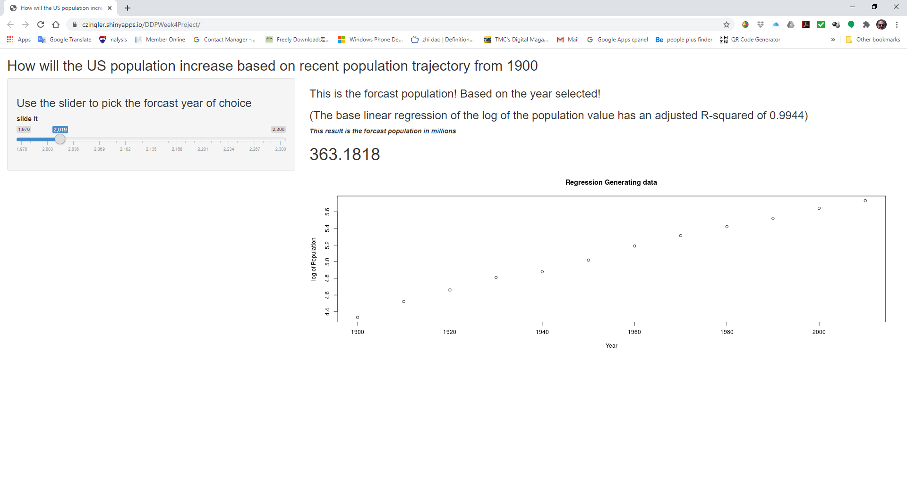
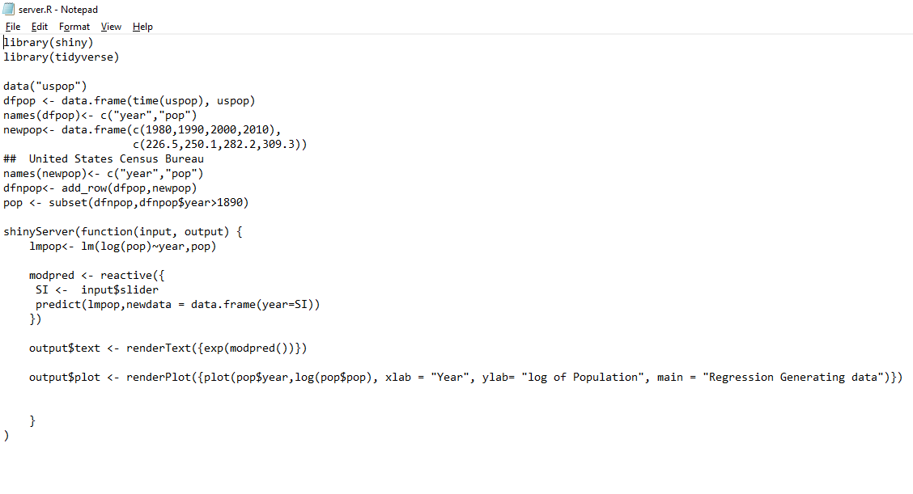
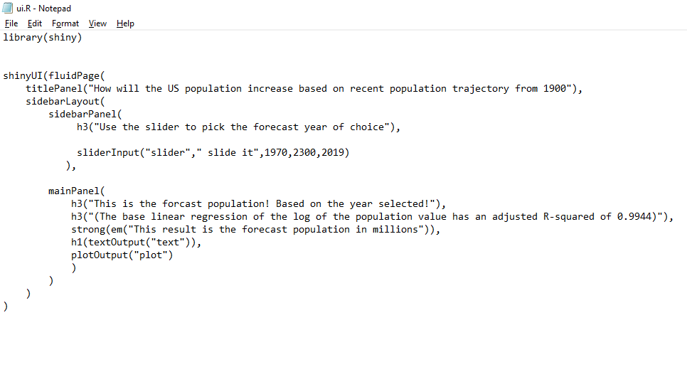

```{r setup, include=FALSE}
knitr::opts_chunk$set(echo = FALSE)
```
 
### Objective (1)
*Create Shiny App incorporating a ui.R and a server.R files*

**the App is running at (https://czingler.shinyapps.io/DDPWeek4Project/)**   

  
```{r, out.width='100%', fig.align='center', fig.cap='...'}

```


### Objective (2)  
*Upload the application files to a Github repository*  

**This is the ui and server code**  
**The R scripts stored at (https://github.com/czingler/DevelpingDataProducts)**  

```{r, out.width='75%', fig.align='left', fig.cap='...'}


```

### Data used 
```{r echo=TRUE}
suppressWarnings(library(tidyverse))
data("uspop")
dfpop <- data.frame(time(uspop), uspop)
names(dfpop)<- c("year","pop")
newpop<- data.frame(c(1980,1990,2000,2010),
                    c(226.5,250.1,282.2,309.3))
##  United States Census Bureau
names(newpop)<- c("year","pop")
dfnpop<- add_row(dfpop,newpop)
pop <- subset(dfnpop,dfnpop$year>1890)

print(pop)
```

### Conclusion
*The Shiny App is available to Run at ((https://czingler.shinyapps.io/DDPWeek4Project/)*  
*All the relevant R Script files as well as the Slidy presentation Rmd file is stored at*
*(https://github.com/czingler/DevelpingDataProducts)*  

Thank you for viewing my presentation.


